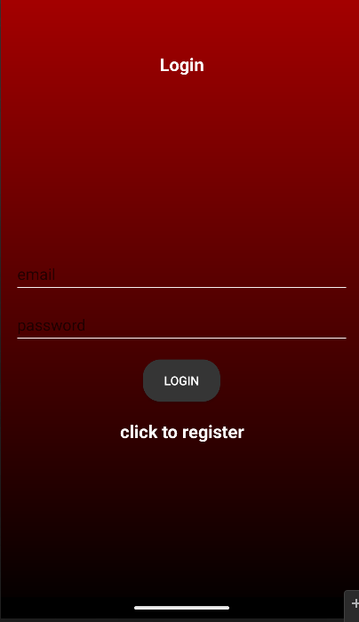
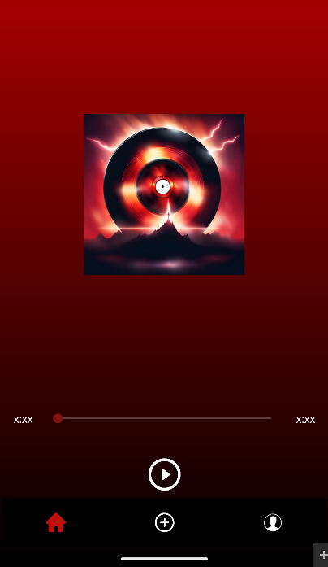
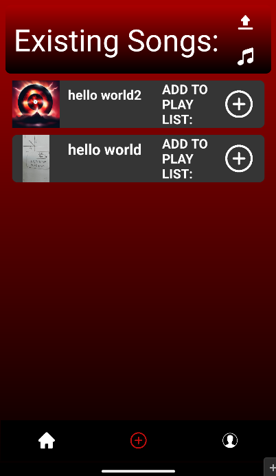
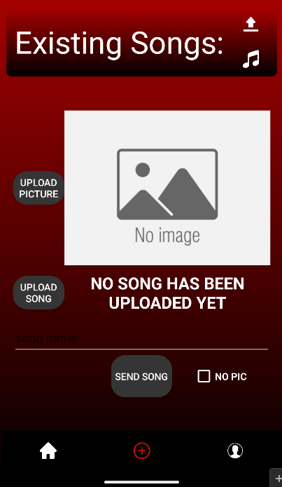

# Music Player

## Overview:
This is a music player that supports storing songs, pictures for the songs, and playlists and listening to them in the app.

> [!Note]
> The project was developed on the Giraffe version of Android Studio. Compatibility issues may arise with other versions due to Android Studio's known compatibility issues.

### Current features support:
- Listening to the songs stored in Firebase Storage, skipping within the song, and pausing.
- Displaying a list of songs stored in Firebase Realtime Database.
- Logging in and signing up using Firebase Authentication.
- Uploading a new song with the song file and a picture of the song.
- Creating albums with a picture and a song.

### Tools used:
- Glide: to take photos from the user and convert them to URI.
- Firebase Authentication: for login and signup.
- Firebase Realtime Database: for storing the relationships between the songs and the playlists.
- Firebase Storage: for storing the pictures and songs themselves.

### Current goals:
- [ ] Saving the songs locally as well.
- [ ] Managing the privacy and publicity settings of the songs.
- [ ] Simplifying the process of creating playlists and listening to them within the app.

## Some pictures of how it looks:

